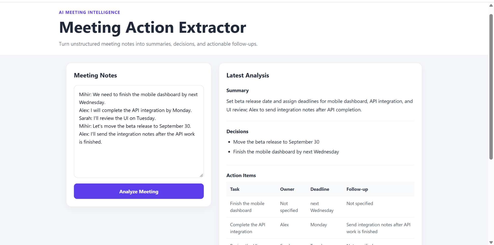
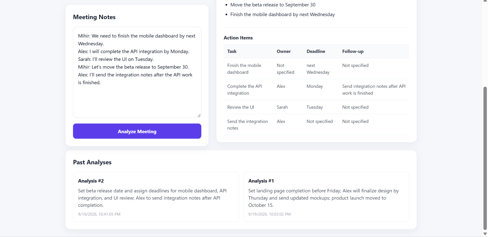

# Meeting Action Extractor

A full-stack AI application that converts unstructured meeting notes into concise summaries, decisions, and structured action items.

The application uses a React and TypeScript frontend, a FastAPI backend, the OpenAI API for structured meeting analysis, and PostgreSQL for storing previous analyses.

## Features

- Paste unstructured meeting notes into a browser interface
- Generate a concise meeting summary using the OpenAI API
- Extract explicit decisions from the meeting
- Identify action items with:
  - Task
  - Owner
  - Deadline
  - Follow-up
- Validate AI-generated structured output before saving it
- Store completed analyses in PostgreSQL
- View and reopen previous meeting analyses
- Responsive React and TypeScript interface

## Screenshots

### Meeting Analysis



### Analysis History



## Tech Stack

### Frontend

- React
- TypeScript
- Vite
- CSS

### Backend

- Python
- FastAPI
- Pydantic
- SQLAlchemy
- Uvicorn

### AI

- OpenAI API
- Structured JSON extraction

### Database

- PostgreSQL
- Supabase PostgreSQL

## Architecture

```text
React + TypeScript Frontend
          |
          | HTTP
          v
     FastAPI Backend
          |
          +-------------------+
          |                   |
          v                   v
    OpenAI API           PostgreSQL
    AI Analysis          Analysis History
```

The frontend sends meeting notes to the FastAPI backend.

The backend sends the notes to the OpenAI API with instructions to return structured meeting information. The returned data is parsed and validated using Pydantic before being stored in PostgreSQL.

The completed analysis is then returned to the frontend and displayed to the user.

## Project Structure

```text
meeting-action-extractor/
|
|-- backend/
|   |-- ai_service.py
|   |-- database.py
|   |-- main.py
|   |-- models.py
|   |-- schemas.py
|   |-- requirements.txt
|
|-- frontend/
|   |-- src/
|   |   |-- App.tsx
|   |   |-- App.css
|   |   |-- index.css
|   |
|   |-- package.json
|
|-- screenshots/
|   |-- main-analysis.png
|   |-- history.png
|
|-- .gitignore
|-- README.md
```

## How It Works

### 1. Submit Meeting Notes

The user enters meeting notes into the React frontend.

Example:

```text
Mihir: We need to finish the mobile dashboard by next Wednesday.
Alex: I will complete the API integration by Monday.
Sarah: I'll review the UI on Tuesday.
Mihir: Let's move the beta release to September 30.
```

### 2. Send Notes to FastAPI

The frontend sends the notes to:

```text
POST /analyze
```

Request body:

```json
{
  "meeting_notes": "Meeting notes..."
}
```

### 3. AI Analysis

The backend sends the notes to the OpenAI API and requests structured JSON containing:

```json
{
  "summary": "Concise meeting summary",
  "decisions": ["Decision made during the meeting"],
  "action_items": [
    {
      "task": "Task description",
      "owner": "Person responsible",
      "deadline": "Deadline",
      "follow_up": "Follow-up action"
    }
  ]
}
```

The model is instructed not to invent owners, deadlines, decisions, or follow-up actions that were not present in the meeting notes.

### 4. Validate Structured Output

The AI response is parsed as JSON and validated using Pydantic models before it is stored.

The validated structure includes:

```text
summary
decisions
action_items
    task
    owner
    deadline
    follow_up
```

This prevents malformed AI responses from being treated as valid meeting analyses.

### 5. Store Analysis

The analysis is saved to PostgreSQL using SQLAlchemy.

Each stored analysis includes:

- Original meeting notes
- Summary
- Decisions
- Action items
- Creation timestamp

### 6. View Analysis History

The frontend retrieves previous analyses using:

```text
GET /analyses
```

Previous results are displayed in the Past Analyses section and can be reopened from the interface.

## API Endpoints

### Health Check

```http
GET /
```

Example response:

```json
{
  "message": "Meeting Action Extractor API is running"
}
```

### Analyze Meeting

```http
POST /analyze
```

Example request:

```json
{
  "meeting_notes": "Alex will finish the API integration by Monday."
}
```

Example response:

```json
{
  "id": 1,
  "meeting_notes": "Alex will finish the API integration by Monday.",
  "summary": "Alex is responsible for completing the API integration.",
  "decisions": [],
  "action_items": [
    {
      "task": "Complete the API integration",
      "owner": "Alex",
      "deadline": "Monday",
      "follow_up": null
    }
  ],
  "created_at": "2026-09-19T22:00:00"
}
```

### Retrieve Previous Analyses

```http
GET /analyses
```

Returns previously stored meeting analyses ordered from newest to oldest.

## Running the Project Locally

### Prerequisites

Install:

- Python 3.12+
- Node.js 22+
- npm
- PostgreSQL database
- OpenAI API key

## Backend Setup

Navigate to the backend directory:

```powershell
cd backend
```

Create a virtual environment:

```powershell
python -m venv venv
```

Activate it on Windows:

```powershell
.\venv\Scripts\Activate.ps1
```

Install dependencies:

```powershell
pip install -r requirements.txt
```

Create a `.env` file inside the `backend` directory:

```text
OPENAI_API_KEY=your_openai_api_key
DATABASE_URL=your_postgresql_connection_string
```

Start the backend:

```powershell
uvicorn main:app --reload
```

The API will run at:

```text
http://127.0.0.1:8000
```

## Frontend Setup

Open another terminal and navigate to the frontend directory:

```powershell
cd frontend
```

Install dependencies:

```powershell
npm install
```

Start the development server:

```powershell
npm run dev
```

The frontend will run at:

```text
http://localhost:5173
```

## Environment Variables

The project requires these backend environment variables:

```text
OPENAI_API_KEY
DATABASE_URL
```

The `.env` file is excluded from version control and should never be committed to GitHub.

## Current Scope

This project focuses on demonstrating a complete AI application workflow:

```text
Meeting Notes
      |
      v
React Frontend
      |
      v
FastAPI Backend
      |
      v
OpenAI Analysis
      |
      v
Pydantic Validation
      |
      v
PostgreSQL Storage
      |
      v
Analysis History
```

Potential future improvements could include authentication, editing extracted tasks, exporting meeting results, and additional model evaluation.

## Security Notes

Sensitive values such as API keys and database credentials are stored in environment variables and excluded from version control.

No API keys or PostgreSQL credentials should be committed to the repository.

## Author

Mihir Karnani
